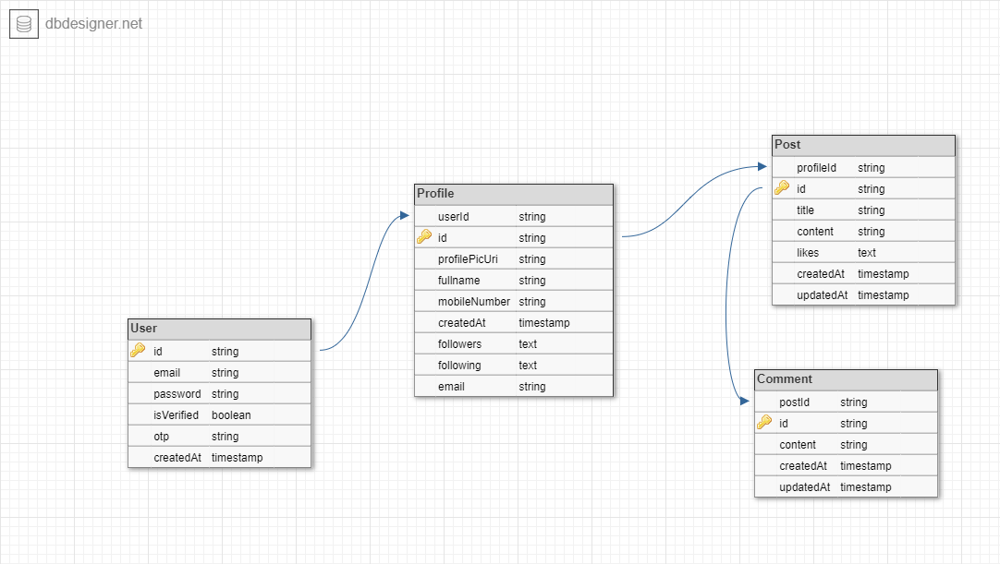

# social-media-api
Backend for a hypothetical social media app which allows users to register and login to accounts, create profiles, follow and unfollow other users as well as create posts and comments.

## Project Goals
The main goals of this project include;
- Learning Continous Integration and automated testing using github actions
- Learning how to use Docker and Docker compose
- Learning how to use Prisma ORM 
- Learning to setup swagger with express and typescript

## Requirements
- [Nodejs](https://nodejs.org/en/) is a JavaScript runtime built on Chrome's V8 JavaScript engine.
- [Express](https://expressjs.com/) is a minimal and flexible Node.js web application framework that provides a robust set of features for web and mobile applications. 
- [PostgreSQL](https://www.postgresql.org/) is a powerful, open source object-relational database system with over 35 years of active development that has earned it a strong reputation for reliability, feature robustness, and performance.
- [Prisma](https://www.prisma.io/) Prisma is a server-side library that helps developers read and write data to the database in an intuitive, efficient and safe way. It is easy to integrate into your framework of choice, Prisma simplifies database access, saves repetitive CRUD boilerplate and increases type safety. Its the perfect companion for building production-grade, robust and scalable web applications
- [Typescript](https://www.typescriptlang.org/)  is a strongly typed programming language that builds on JavaScript, giving you better tooling at any scale.
- [Docker compose](https://docs.docker.com/compose/) is a tool for defining and running multi-container Docker applications. With Compose, you use a YAML file to configure your application’s services. Then, with a single command, you create and start all the services from your configuration.

## Installation
```
$ npm install
```
## Running the app
```
# development
$ npm run dev
```
```
# build
$ npm run build
```
```
# prod
$ npm run start
```

## API Endpoints
| HTTP Verbs | Endpoints | Action | Required |
| --- | --- | --- | --- |
| POST | localhost:3000/api/v1/auth/register | register a new user | req.body.email <br> req.body.password |
| POST | localhost:3000/api/v1/auth/login | log a user in | req.body.email <br> req.body.password |
| PATCH | localhost:3000/api/v1/auth/change-password | change user password | req.body.oldPassword <br> req.body.newPassword <br> req.body.email |
| POST | localhost:3000/api/v1/profile/create-profile | create a profile for a user | req.body.email <br> req.body.mobileNumber <br> req.body.profilePicUri <br> req.body.fullname <br> req.body.userId <br> req.body.bio |
| GET | localhost:3000/api/v1/profile/:email | gets a user profile | req.params.email |
| PATCH | localhost:3000/api/v1/profile/follow/:profileId/:followerId | follow another user | req.params.profileId <br> req.params.followerId |
| PATCH | localhost:3000/api/v1/profile/unfollow/:profileId/:followingId | unfollow a user | req.params.profileId <br> req.params.followingId |
| GET | localhost:3000/api/v1/profile/followers/:profileId | get profiles following user | req.params.profileId |
| GET | localhost:3000/api/v1/profile/following/:profileId | get profiles a user is following | req.params.profileId |
| POST | localhost:3000/api/v1/posts/create-post | create a post | req.body.profileId <br> req.body.titile <br> req.body.content |
| GET | localhost:3000/api/v1/posts/:postId | get a single post by id | req.params.postId |
| GET | localhost:3000/api/v1/posts/profile-posts/:profileId | get all posts made by a user | req.params.profileId |
| DELETE | localhost:3000/api/v1/posts/:postId | delete a post | req.params.profileId |
| POST | localhost:3000/api/v1/comments/create-comment | create a comment under a post | req.body.postId <br> req.body.content <br> req.body.content |
| GET | localhost:3000/api/v1/comments/:postId | get all comments under a post | req.params.postId |
| GET | localhost:3000/api/v1/comments/:commentId | get a single comment | req.params.commentId |
| DELETE | localhost:3000/api/v1/comments/:commentId | delete a comment | req.params.commentId |

## Database Design
```
texts were used instead of lists or arrays in the following and followers field of the profile table as well as the likes field of the post table due to the fact that the db design tool did not give that option
```


## Running tests
```
$ npm run test
```
## Possible Areas of improvement
- validation of request data
- making use of refresh tokens together with access tokens for security
- adding api rate limiting
- setting up helmet to protect api from known vulnerabilities. 

## Author
[Alahira Jeffrey]((https://github.com/alahirajeffrey))
